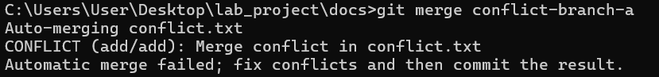
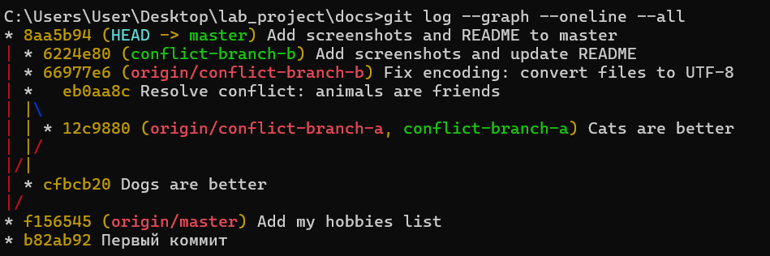

# 🧪 Лабораторная работа №3: Работа с Git

## 📌 Цель работы
Освоить базовые операции Git: создание репозитория, работу с ветками, разрешение конфликтов слияния, отправку изменений на GitHub.

---

## 🔧 Ход выполнения

### 1. Создание репозитория и первый коммит
- Инициализирован локальный репозиторий
- Создан файл `instructions.txt`
- Выполнен первый коммит

### 2. Работа с ветками
- Создана ветка `feature/hobby`
- Добавлен файл `hobby.txt` с увлечениями
- Ветка слита с `master` (Fast-forward)

### 3. Моделирование конфликта
- Созданы ветки `conflict-branch-a` и `conflict-branch-b`
- В каждой ветке создан файл `conflict.txt` с разным содержимым
- При попытке слияния возник конфликт

### 4. Разрешение конфликта
- Конфликт разрешён вручную
- Оставлен итоговый текст: *«Коты и собаки — оба прекрасны!»*

### 5. Публикация на GitHub
- Создан удалённый репозиторий
- Выполнен `git push` всех веток

---

## 📸 Скриншоты

### Конфликт при слиянии

### Граф коммитов

---

## ✅ Вывод
В ходе работы были освоены основные команды Git, изучен механизм ветвления и разрешения конфликтов. Все изменения успешно загружены в удалённый репозиторий.
